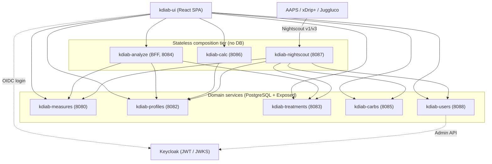
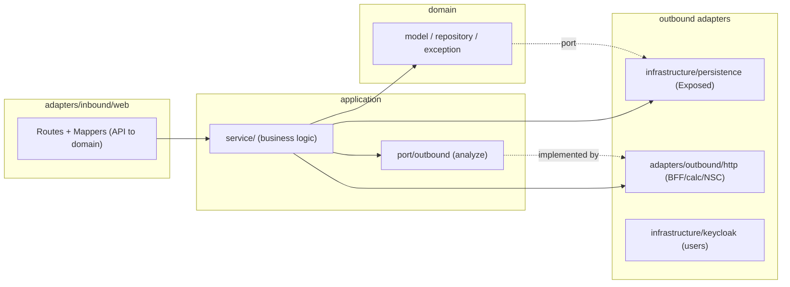
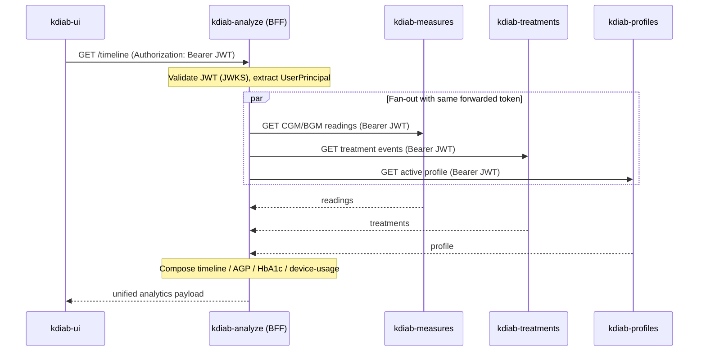
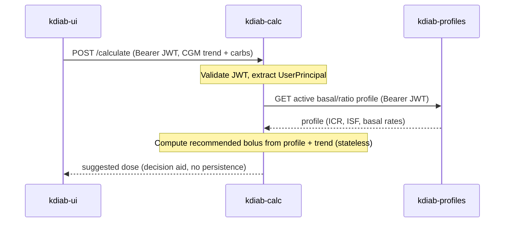
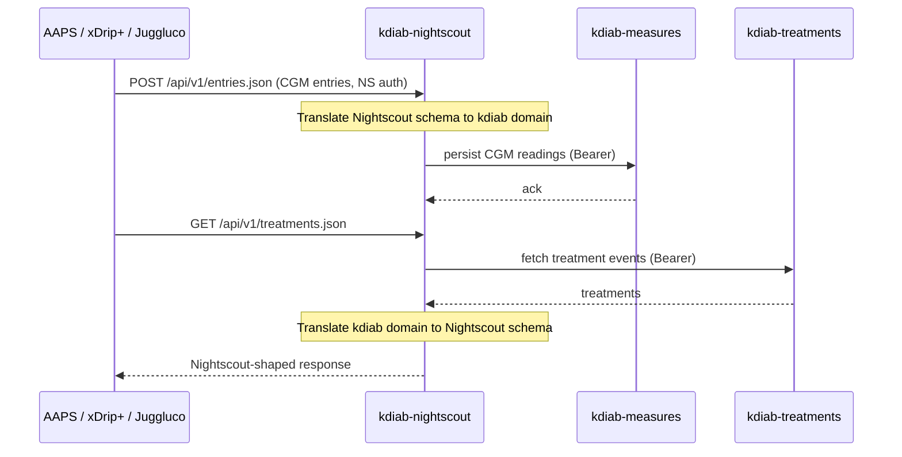

# Architecture — kdiab (T1D Management Platform)

## System Overview

kdiab is a **service-oriented platform** built as a **Gradle composite (included) build**:
8 runnable Ktor backend services plus one shared library, a React SPA, and a `build-logic`
included build carrying the shared convention plugins. Every backend is an independent
Gradle root (`includeBuild`, not subprojects), so each service builds, tests, and ships as
its own unit while still sharing conventions and typed API clients.

Three cross-cutting patterns define the architecture:

1. **Hexagonal (ports and adapters)** — every backend service has the same layered shape:
   inbound web adapters → application services → domain model, with outbound adapters
   (HTTP or persistence) behind ports. Domain code has no framework dependencies.
2. **API-first / spec-first** — each service's `api/openapi.yaml` is the single source of
   truth. Server stubs and typed clients are generated from the spec before compilation;
   cross-service coupling at build time is **spec-only** (generated typed clients), and the
   frontend regenerates its clients from the same specs.
3. **Backend-for-Frontend (BFF) + stateless composition** — three services (analyze, calc,
   nightscout) hold no database. They compose data by calling upstream services over HTTP,
   forwarding the user's JWT unchanged, and returning purpose-built read/compute results.

## Architectural Style

**Modular service-oriented (a pragmatic microservices topology).** Evidence:

- 8 independently deployable Ktor apps, each with its own port, Dockerfile, OpenAPI spec,
  and CI workflow.
- Clear ownership boundaries per clinical domain (measures, profiles, treatments, carbs, users).
- Stateless composition tier (analyze/calc/nightscout) with no shared database — services
  own their data and expose it only via API.
- Shared concerns are factored into a **library** (kdiab-common) and **convention plugins**
  (`build-logic`), not a shared runtime, keeping services decoupled at runtime while uniform
  in construction.

The persistence-owning services (measures, profiles, treatments, carbs, users) are stateful;
the composition services (analyze, calc, nightscout) are stateless and horizontally trivial
to scale.

## Component Relationships

**Text fallback:** The React SPA (kdiab-ui) authenticates against Keycloak via OIDC and
calls the analyze, calc, and the five domain services (measures, profiles, treatments,
carbs, users) directly. The composition tier is stateless: analyze fans out to measures,
treatments, and profiles; calc calls profiles only; nightscout fans out to measures,
treatments, carbs, profiles, and users. External looping/monitoring apps (AAPS, xDrip+,
Juggluco) reach the platform through the nightscout Nightscout v1/v3 compatibility facade.
kdiab-users additionally calls the Keycloak Admin API. The five domain services own
PostgreSQL databases via Exposed ORM; the three composition services hold no database.

## Layered (Hexagonal) Structure — per service

**Text fallback:** Inbound web adapters (Ktor routes + API-to-domain mappers) call
application services. Services depend on the pure domain model (model, repository ports,
exceptions). Outbound work goes through ports: persistence-owning services implement
repository ports with Exposed-backed persistence adapters; composition services define
outbound ports in `application/port/outbound` (analyze) implemented by HTTP client adapters
in `adapters/outbound/http`; kdiab-users additionally has a Keycloak adapter under
`infrastructure/keycloak`. The three stateless services have no persistence layer.

## Interaction Diagrams

These depict how key business transactions are implemented across components.

### 1. Analytics dashboard read via the BFF (JWT fan-out)

**Text fallback:** The SPA calls the analyze BFF with the user's bearer token. Analyze
validates the JWT via JWKS and extracts the UserPrincipal, then fans out in parallel to
measures (readings), treatments (events), and profiles (active profile), forwarding the
**same unchanged token** to each. A single Keycloak token carries audience mappers for all
8 backends, so every upstream accepts it. Analyze then composes the timeline / AGP / HbA1c /
device-usage read model and returns one payload. Circuit breakers and rate limiting from
kdiab-common protect each upstream call.

### 2. Bolus dose calculation via kdiab-calc

**Text fallback:** The SPA posts the current CGM trend and carbohydrate intake to the
single calc endpoint with the user's bearer token. calc validates the JWT, fetches the
user's active profile (insulin-to-carb ratio, insulin sensitivity factor, basal rates)
from profiles using the forwarded token, computes a recommended bolus purely in memory,
and returns it as a decision aid. calc holds no database and persists nothing.

### 3. Nightscout entry sync (external ecosystem interop)

**Text fallback:** External community apps speak the Nightscout v1/v3 API to the nightscout
facade. On write (e.g. `POST /api/v1/entries.json`), nightscout translates the Nightscout
schema into kdiab domain objects and forwards them to the owning service (measures for CGM
entries). On read (e.g. `GET /api/v1/treatments.json`), nightscout fetches from the owning
service (treatments) and translates the kdiab domain back into the Nightscout schema the
external app expects. nightscout fans out to five upstreams (measures, treatments, carbs,
profiles, users) and holds no database of its own.

## Data Flow

- **Write path (patient app / external app):** UI or Nightscout client → owning domain
  service → Exposed/HikariCP → PostgreSQL. Liquibase (run as a dedicated superuser container,
  never embedded in the app) manages schema.
- **Read/compute path (analytics, dose):** UI → stateless composition service → HTTP fan-out
  to owning services (JWT forwarded) → in-memory composition/computation → UI. No composition
  service persists.
- **Identity flow:** UI performs OIDC login against Keycloak; the resulting JWT is presented
  on every call and validated per service via JWKS; authorization is enforced by
  `UserPrincipal.canAccess`.
- **Correlation:** every request carries `X-Correlation-ID` (generated by the frontend Axios
  interceptor or the backend CallId plugin) bound to the SLF4J MDC and propagated across the
  fan-out for end-to-end tracing; OpenTelemetry traces are exported via gRPC.

## Key Design Decisions

- **Composite build over multi-module project** — each service is a standalone Gradle root,
  enabling independent lifecycles. `dependencySubstitution` swaps published `kdiab-*-spec`
  coordinates for local project dependencies so cross-service typed clients resolve locally
  during development.
- **Spec-only build coupling, HTTP runtime coupling** — services never share domain code;
  they share only generated typed clients derived from OpenAPI specs. This keeps runtime
  boundaries clean and lets each service version its own contract.
- **Single forwarded JWT with multi-audience mappers** — analyze and calc forward the user's
  token unchanged; a single Keycloak token is accepted by all 8 backends via audience mappers,
  avoiding token exchange or service-to-service credentials on the read path.
- **Stateless composition tier** — analytics and dose calculation are computed on demand from
  authoritative sources rather than materialised, trading compute for simplicity and freshness.
- **Convention plugins absorb boilerplate** — `kdiab.kotlin-base`, `kdiab.ktor-service`,
  `kdiab.ktor-db-service` standardise codegen, test suites, Kover, Detekt, and security-pinned
  transitives across services.

## Improvement Opportunities (intent: "review technology and domain and suggest improvements")

Prioritised for this review. Detailed debt signals and evidence are in
`code-quality-assessment.md`; the highest-leverage architectural items are:

1. **[High] Close the UI API-client generation gap.** `api:generate` regenerates typed clients
   for only 4 of 8 backends (measures, profiles, treatments, analyze). carbs, calc, nightscout,
   and users have OpenAPI specs but hand-written Axios clients — a divergence risk against the
   spec-first invariant. Regenerating all 8 restores contract safety end-to-end.
2. **[High] Complete the Nightscout v3 HISTORY endpoints.** `/api/v3/{collection}/history` are
   stubs (TODO #894–#898). The external interop surface is partially incomplete, which directly
   affects the ecosystem-interop domain promise.
3. **[Medium] Reduce composition-tier build complexity.** `registerUpstreamSpec` +
   `dependencySubstitution` is bespoke build-logic that the three fan-out services must keep in
   sync on every dependency/version change. Consider a single declarative upstream-spec manifest.
4. **[Medium] Unify service versioning.** Versions drift (measures 0.0.1, seven at 0.1.0, common
   0.0.0-SNAPSHOT); there is no platform version. A unified version scheme aids release traceability.
5. **[Medium] Reconsider blanket `suppressWarnings.set(true)` in kdiab-analyze** — it masks genuine
   compiler warnings across the largest composition service.
6. **[Low] Reduce residual per-service boilerplate** — near-identical `openApiGenerate`/`kover`
   blocks, per-module Detekt config/baseline, and Dockerfiles remain despite the convention plugins.

The domain/architecture is fundamentally sound: boundaries are clean, coupling is spec-only at
build time and HTTP-only at runtime, and the authorization invariant is centralised. The
opportunities above are refinements, not restructurings.
