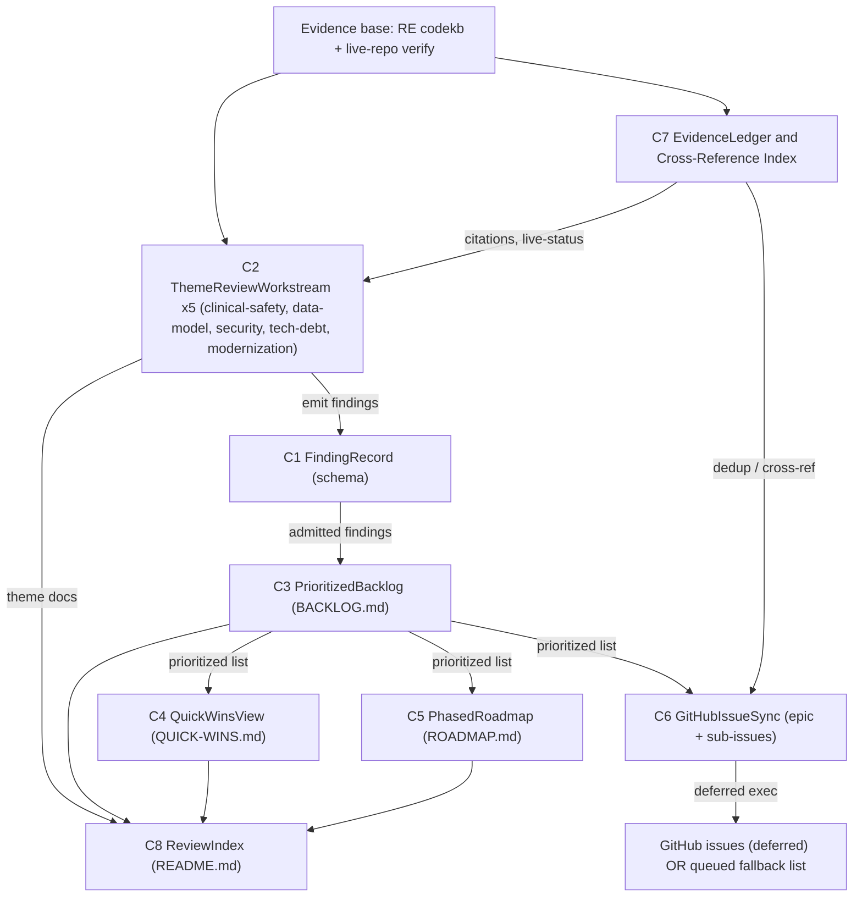

# Component Dependency — Review Deliverable System

**Stage:** application-design (2.6) · Companion to `components.md`.
**Upstream inputs:** `requirements.md`, `stories.md`, `team-practices.md`, codekb `architecture.md`.

> The dependency graph is deliberately a shallow DAG: evidence flows one way (workstreams → findings →
> backlog → projections), and only one component (C6) touches the outside world. This mirrors the
> platform's own "least coupling" property documented in codekb `architecture.md`.

## Dependency Matrix

Rows depend on columns (X = "reads from / is fed by").

| Component \\ depends on | C1 Finding | C2 Workstream | C3 Backlog | C7 Ledger | Evidence (codekb+live) |
|---|:---:|:---:|:---:|:---:|:---:|
| C1 FindingRecord | — | | | | |
| C2 ThemeReviewWorkstream ×5 | X | — | | X | X |
| C3 PrioritizedBacklog | X | X | — | | |
| C4 QuickWinsView | X | | X | | |
| C5 PhasedRoadmap | X | | X | | |
| C6 GitHubIssueSync | X | | X | X | |
| C7 EvidenceLedger | X | | | — | X |
| C8 ReviewIndex | | | | | (reads doc set) |

Key observations:

- **C1 FindingRecord depends on nothing** — a pure value object, the shared vocabulary every other
  component speaks. This is the single most important boundary in the design.
- **C3 PrioritizedBacklog is the hub** — C4/C5/C6 all read from it and never re-derive ordering.
- **C7 EvidenceLedger is a cross-cutting service** — used by every workstream (citations) and by C6 (dedup).
- **C6 GitHubIssueSync is the only outward edge** — the sole component with an external dependency (`gh`).

## Data-Flow Diagram

<!-- Text fallback: The evidence base (RE codekb plus live-repo verification) feeds two things: the
EvidenceLedger (C7) and the five ThemeReviewWorkstreams (C2). C7 supplies each workstream with evidence
citations and live-resolution status. Each workstream emits FindingRecords (C1 schema), which are admitted
to the PrioritizedBacklog (C3). C3 is the hub: it feeds the QuickWinsView (C4), the PhasedRoadmap (C5), and
the GitHubIssueSync (C6) with the single prioritized list. C7 also feeds C6 for dedup and cross-referencing.
The ReviewIndex (C8) links the theme docs and the three cross-cutting deliverables. C6 projects onto GitHub
issues (execution deferred) or, on gh-unavailability, a queued fallback list inside the docs. -->

## Communication Patterns

| Edge | Pattern | Timing |
|---|---|---|
| Evidence → C2 / C7 | synchronous read (file + `gh`/`git` live check) | review-time |
| C2 → C1 → C3 | in-process value passing (findings authored, then aggregated) | review-time |
| C3 → C4 / C5 / C6 | synchronous read of the prioritized list (no back-edge) | review-time |
| C7 → C6 | synchronous dedup lookup | review-time (issue phase, deferred) |
| C6 → GitHub | outbound `gh` CLI / GraphQL, **or** queued list on failure | deferred / on tooling failure |

There are **no cyclic dependencies** and **no shared mutable state** — the backlog is written once by C3
and read-only thereafter, which is why the three projections can run in any order. This one-way flow is
what makes each deliverable independently regenerable (NFR-2 independence) and the whole review idempotent.

## Shared Resources

- **The prioritized backlog (C3 output)** — the one shared read-only resource; all projections read it.
- **The EvidenceLedger (C7)** — shared citation/dedup authority; centralizing it is what keeps NFR-1
  (100% evidence-linkage) and FR-D.5 (no duplicate issues) enforceable in a single place.
- **`docs/review/` directory** — the shared output surface, path-pinned by FR-D.1 (resolves OQ-3).
