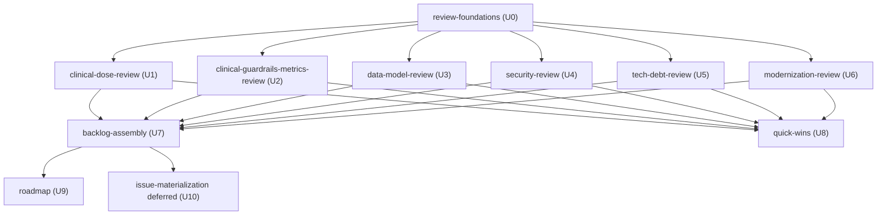

# Unit-of-Work Dependency Topology — Technology & Domain Review

**Stage:** units-generation (2.7) · Companion to `unit-of-work.md`.
**Upstream inputs:** Application Design `components.md`, `component-methods.md`, `services.md`,
`component-dependency.md`, `decisions.md`; `requirements.md`; `stories.md`. (The unit topology is derived
chiefly from `component-dependency.md`'s data-flow and the `stories.md` dependency structure; the component
interfaces in `component-methods.md` and the two production `services.md` define the integration contracts.)

> This artifact describes **topology only** — what can depend on what. It does NOT pick a build order or a
> critical path; those are Delivery Planning (2.8) decisions that consume this DAG. The topology mirrors the
> one-way data flow in Application Design's `component-dependency.md` (findings → backlog → projections) and
> the story dependency structure in `stories.md`.

## Dependency Overview

- **U0 review-foundations is the dependency root** — every theme unit reuses the shared FindingRecord schema
  + EvidenceLedger, so all six theme units depend on U0 and nothing precedes it.
- **The six theme units (U1–U6) are mutually independent** — no edges among them (INVEST independence from
  `stories.md`). They fan out from U0 and can be worked in any order or in parallel.
- **U7 backlog-assembly and U8 quick-wins both fan in over the findings (U1–U6)** and are independent of each
  other — U8 does not depend on U7 (see the rationale below).
- **U9 roadmap and U10 issue-materialization depend on U7** — the roadmap sequences the assembled backlog
  (US-9 depends on US-7), and issues materialize it (deferred execution).

### Why quick-wins (U8) does not depend on backlog-assembly (U7)

Application Design's `component-dependency.md` shows QuickWinsView (C4) reading the PrioritizedBacklog (C3).
`stories.md`, however, lists US-8 as **independent** of US-7 ("draws from whatever findings exist"). A
quick-win is simply an `effort=S`, high-value finding — computable directly from the theme findings without
the full prioritized ordering. Modelling U8 → [U1…U6] (not U8 → U7) keeps the DAG faithful to the story
dependency structure and lets U7 and U8 proceed in parallel. This is a deliberate refinement of the design's
C4→C3 edge, recorded in the stage diary.

## Machine-readable edge block

```yaml
units:
  - name: review-foundations
    depends_on: []
  - name: clinical-dose-review
    depends_on: [review-foundations]
  - name: clinical-guardrails-metrics-review
    depends_on: [review-foundations]
  - name: data-model-review
    depends_on: [review-foundations]
  - name: security-review
    depends_on: [review-foundations]
  - name: tech-debt-review
    depends_on: [review-foundations]
  - name: modernization-review
    depends_on: [review-foundations]
  - name: backlog-assembly
    depends_on: [clinical-dose-review, clinical-guardrails-metrics-review, data-model-review, security-review, tech-debt-review, modernization-review]
  - name: quick-wins
    depends_on: [clinical-dose-review, clinical-guardrails-metrics-review, data-model-review, security-review, tech-debt-review, modernization-review]
  - name: roadmap
    depends_on: [backlog-assembly]
  - name: issue-materialization
    depends_on: [backlog-assembly]
```

## Dependency Diagram



<!-- Text fallback: review-foundations (U0) is the root, with no dependencies. The six theme units —
clinical-dose-review (U1), clinical-guardrails-metrics-review (U2), data-model-review (U3), security-review
(U4), tech-debt-review (U5), modernization-review (U6) — each depend on U0 and on nothing else, so they are
mutually independent. backlog-assembly (U7) and quick-wins (U8) each depend on all six theme units and are
independent of each other. roadmap (U9) and issue-materialization (U10, deferred) each depend on
backlog-assembly (U7). The graph is acyclic. -->

## Integration Points Between Units

| Edge | Integration contract |
|---|---|
| U0 → U1…U6 | the shared `FindingRecord` schema + evidence-link format + live-verify guard (the vocabulary every finding uses) |
| U1…U6 → U7 | admitted, validated `FindingRecord`s aggregated into the prioritized backlog |
| U1…U6 → U8 | the same findings, filtered by the quick-win predicate (effort=S, high value) |
| U7 → U9 | the prioritized backlog list, grouped into Near/Mid/Long bands |
| U7 → U10 | the prioritized backlog, projected onto GitHub issues (deferred; dedup via the cross-reference index) |

## Parallel Development Opportunities

Multiple valid topological orderings exist — this artifact does not choose among them (that is 2.8's job):

- **After U0:** U1, U2, U3, U4, U5, U6 may all proceed **in parallel** (no inter-theme edges).
- **After U1–U6:** U7 and U8 may proceed **in parallel** (neither depends on the other).
- **After U7:** U9 and U10 may proceed **in parallel**.

The topology is acyclic and every `depends_on` name is a declared unit; no unit depends on itself.
