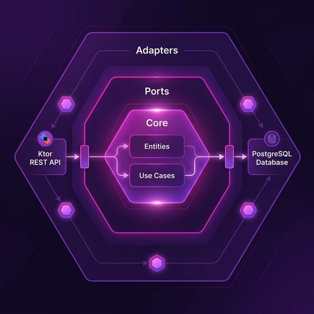

= T1D Measures Service Architecture
:toc: left

== Project Overview & Principles

=== Technology Stack
* **Language**: Kotlin
* **Framework**: Ktor (Server)
* **Build Tool**: Gradle Kotlin DSL
* **Persistence**: PostgreSQL
* **ORM/SQL**: Exposed
* **Frontend**: React + TypeScript + Vite
* **Containerization**: Docker / Docker Compose

=== AI Development Strategy
We utilize specific **AI Agent Personas** to guide development. See link:ai-agents.html[AI Agent Personas] for details on roles like QA, Security, and DevOps agents.

== 2. Flexible Storage Patterns
We utilize the **JSONB** capabilities of PostgreSQL to handle the high variability of health measurement data.

=== 2.1 Partitioning by Type and Source
* **Type**: (e.g., `CGM`, `VITALS`, `WEIGHT`) Defines the expected structure of the JSON payload.
* **Source**: (e.g., `MANUAL`, `NIGHTSCOUT`, `GOOGLE_FIT`) Tracks the data origin for auditing and conflict resolution.

This pattern allows us to query all `CGM` data for a specific time range without needing specialized columns for every possible health metric.

== 3. Synchronization Architecture
While the current version focuses on manual entry and API ingestion, the architecture is prepared for external synchronization.

=== 3.1 Future Integration Flow
1. **Sync Inbound Port**: A scheduled adapter triggers a synchronization run.
2. **External Client**: Fetches data from Nightscout or Google Fit REST APIs.
3. **Data Normalization**: Converts external formats into the internal `Measure` domain model.
4. **Idempotent Ingestion**: Uses a combination of `userId`, `measuredAt`, and `externalId` to prevent duplicate data points.

== Code Structure & Standards

=== Package Structure
* **Root Package**: `org.javafreedom.kdiab.measures`

=== Coding Standards & Serialization
* **Serialization**: We use **Kotlinx Serialization** for a pure Kotlin approach.
* **Native Types**:
** **UUID**: `kotlin.uuid.Uuid`.
** **Date/Time**: `kotlinx.datetime`.

== Domain Architecture

=== Data Model (Preliminary)
* **Measures**: The central entity relying on `jsonb` storage for flexibility.

==== Tables
* `measures` (Stores health measurement data)
** `id` (UUID) - Primary Key
** `user_id` (UUID) - Implicit User Management
** `measured_at` (TIMESTAMP WITH TIME ZONE) - Real time of the measurement
** `created_at` (TIMESTAMP WITH TIME ZONE) - When the data was entered into the system
** `type` (VARCHAR) - Defines the struct of the JSON payload (e.g., CGM, BLOOD_PRESSURE, WEIGHT)
** `source` (VARCHAR) - E.g., Nightscout, GoogleFit, Manual
** `data` (JSONB) - Flexible payload (e.g., `{"sgv": 120, "trend": "Flat"}` or `{"systolic": 120, "diastolic": 80}`)

=== JSONB Storage (ADR-201)
Heterogeneous measurement segments are stored as a JSON blob within the `measures` table. This prevents table explosion due to numerous specific fields for every data type and provides flexibility for future health APIs.

== API Design & Integration

=== OpenAPI Specification
* **Spec**: OpenAPI 3.0.
* **Tooling**: We use the **OpenAPI Generator** to generate Ktor server stubs and data classes.

== Service Implementation Details

=== Authentication & Security
* **Mechanism**: OAuth 2.0 / JWT.
* **Stateless**: No server-side session storage.

=== Persistence
* **Database**: PostgreSQL.
* **Why**: Excellent JSONB support which is critical for our flexible measures model.

== Architectural Decision Records (Log)
* link:adr/201-flexible-measures-model.adoc[ADR-201: Flexible Measures Model with JSONB]
