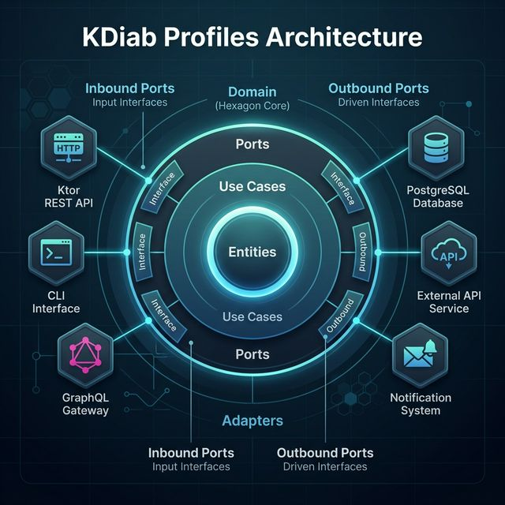

= T1D Basal Profile Service Architecture
:toc: left

== Project Overview & Principles

=== Technology Stack
* **Language**: Kotlin
* **Framework**: Ktor (Server)
* **Build Tool**: Gradle Kotlin DSL
* **Persistence**: PostgreSQL
* **ORM/SQL**: Exposed
* **Frontend**: React + TypeScript + Vite
* **Containerization**: Docker / Docker Compose

=== AI Development Strategy
We utilize specific **AI Agent Personas** to guide development. See link:ai-agents.html[AI Agent Personas] for details on roles like QA, Security, and DevOps agents.

== 2. Testing Strategy
We employ a multi-layered testing strategy to ensure the reliability and correctness of the T1D Profile Service.

=== 2.1 Unit Testing (Domain Logic)
* **Goal**: Verify core business rules (e.g., profile activation, validation).
* **Tools**: JUnit 5, Mockk.
* **Scope**: Domain models and services, isolated from external dependencies.

=== 2.2 Integration Testing (Persistence & API)
* **Goal**: Verify database interactions and API routing.
* **Tools**: Ktor Test Host, H2 (In-memory) or Testcontainers (PostgreSQL).
* **Scope**: Repositories, API controllers, and Liquibase migrations.

=== 2.3 End-to-End (E2E) Testing
* **Goal**: Verify critical user flows (e.g., "Create and Activate Profile").
* **Tools**: Kotest (BehaviorSpec DSL).
* **ADR**: See link:adr/107-bdd-testing-with-kotest.html[ADR-107] for rationale.

== 3. Authorization & Roles
The system implements a role-based access control (RBAC) mechanism.

* **PATIENT**: Full access to their own profiles.
* **DOCTOR**: Read-only access to patient profiles (authorized via external service relationship).
* **ADMIN**: Full read/write access to all system resources.

The authorization is enforced in the **Domain Layer** (Use Cases) to ensure that even if the API layer is bypassed, business rules are still respected.

== Code Structure & Standards

=== Package Structure (ADR-103)
* **Root Package**: `org.javafreedom.kdiab.profiles`
* **Rationale**: Aligns with the organization's domain identity and ensures consistency across artifacts.

=== Coding Standards & Serialization (ADR-104, ADR-105)
* **Serialization**: We use **Kotlinx Serialization** for a pure Kotlin approach, better performance, and multiplatform readiness.
* **Native Types**:
** **UUID**: `kotlin.uuid.Uuid` (replacing `java.util.UUID` in domain).
** **Date/Time**: `kotlinx.datetime` (replacing `java.time` in domain).
* **Rationale**: Idiomatic Kotlin code, avoiding Java-specific dependencies in the core domain.

=== Quality Assurance (ADR-102)
* **Testing**: Minimum **80% code coverage** enforced via **Kover** (Kotlin Native).
* **Static Analysis**: **SonarQube** analysis integrated into the build pipeline.
* **CI/CD**:
** **Build & Test**: Automated Gradle build and test suite.
** **Analysis**: SonarQube quality gate verification.
** **Containerization**: Docker image creation (`backend/Dockerfile`).

== Domain Architecture

=== Data Model (Preliminary)
* **Profiles**: The central entity relying on `jsonb` storage for flexibility.
* **Time Segments**: Independent schedules for Basal, ICR, ISF, and Targets.

==== Tables
* `profiles` (Stores core metadata and time segments as JSON)
** `id` (UUID)
** `user_id` (UUID) - *Implicit User Management*
** `status` (ACTIVE, ARCHIVED, DRAFT, PROPOSED)
** `data` (JSONB) - Contains `basal`, `icr`, `isf`, `targets` arrays.

=== Independent Schedules (ADR-201)
Each profile parameter (Basal, ICR, etc.) has its own independent timeline. This prevents data duplication and aligns with the domain reality where patients adjust specific factors independently.

=== JSONB Storage (ADR-202)
Complex profile segments are stored as a JSON blob within the `profiles` table. This simplifies retrieval (no joins), ensures atomic updates, and facilitates easy archiving.

== API Design & Integration

=== OpenAPI Specification
* **Spec**: OpenAPI 3.0.
* **Tooling**: We use the **OpenAPI Generator** Gradle plugin to generate Ktor server stubs and data classes from the specification.
* **Benefits**: 
** Contract-First Development.
** Client SDK generation.
** Documentation UI (Swagger UI).

== Service Implementation Details

=== Authentication & Security (ADR-303)
* **Mechanism**: OAuth 2.0 / JWT (JSON Web Tokens).
* **Roles**: `user` (Self), `doctor` (ReadOnly Delegated), `admin` (Full Access).
* **Delegation**: Supports read-only access for Doctors based on token claims/relationships.
* **Stateless**: No server-side session storage.

=== User Management (ADR-302)
**Decision**: Implicit User Management.
* We do **not** have a dedicated `Users` table.
* User IDs are stored directly as UUIDs in the `profiles` table.

=== Persistence (ADR-301)
* **Database**: PostgreSQL.
* **Why**: Reliability, ACID compliance, and excellent JSONB support which is critical for our hybrid data model.

== Architectural Decision Records (Log)
* link:../root/adr/profiles/101-development-tooling.html[ADR-101: Standard Development Tooling]
* link:../root/adr/profiles/102-code-quality-standards.html[ADR-102: Code Quality Standards]
* link:../root/adr/profiles/103-package-structure.html[ADR-103: Package Structure Refactoring]
* link:../root/adr/profiles/104-kotlinx-serialization.html[ADR-104: Use Kotlinx Serialization and Native Types]
* link:../root/adr/profiles/105-kotlin-native-types.html[ADR-105: Use Kotlin Native Types in Domain Layer]
* link:../root/adr/profiles/106-global-exception-handling.html[ADR-106: Global Exception Handling]
* link:../root/adr/profiles/201-independent-schedules.html[ADR-201: Independent Time Schedules for Profile Parameters]
* link:../root/adr/profiles/202-jsonb-storage.html[ADR-202: JSONB Storage for Profile Segments]
* link:../root/adr/profiles/301-postgresql.html[ADR-301: Use PostgreSQL for Persistence]
* link:../root/adr/profiles/302-implicit-user-management.html[ADR-302: Implicit User Management]
* link:../root/adr/profiles/303-jwt-authentication.html[ADR-303: OAuth 2.0 / JWT Authentication]
* link:../root/adr/profiles/016-doctor-patient-collaboration.html[ADR-016: Doctor-Patient Collaboration Workflow]
